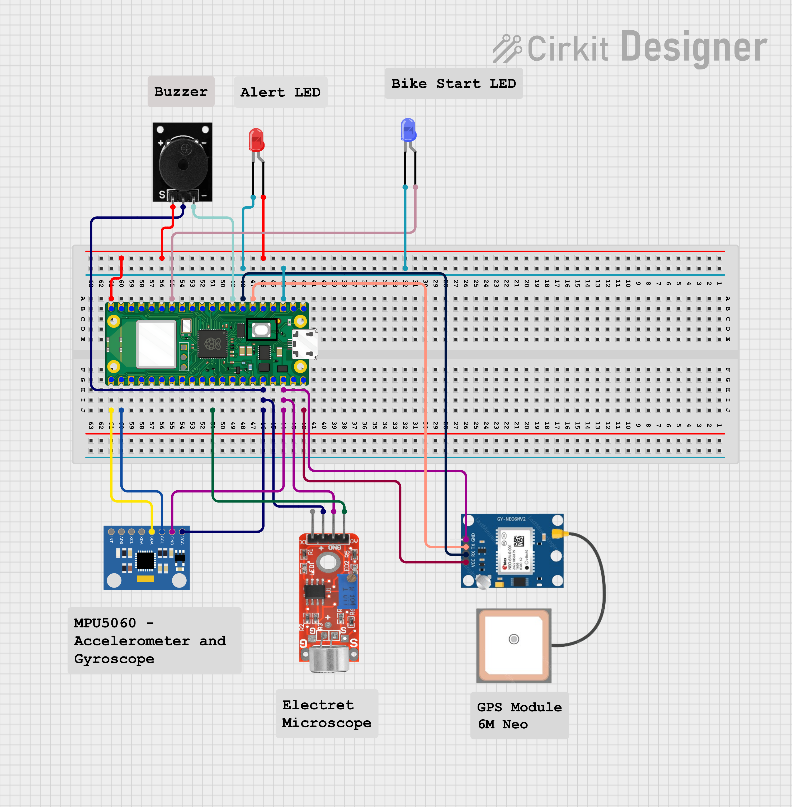

# 🪖 Helmet Fall Detector with Emergency Alert

This project is a **helmet-based fall detection system** that uses the **MPU6050 accelerometer and gyroscope**, a **microphone module**, and a **GPS sensor** to detect falls and **send alerts via Telegram** along with the location and time of the incident. It's built using a **Raspberry Pi Pico W** running MicroPython.

---

## 📦 Components Required

| Component                    | Quantity     | Description                                   |
|------------------------------|--------------|-----------------------------------------------|
| Raspberry Pi Pico W          | 1            | Microcontroller with Wi-Fi capability         |
| MPU6050 (GY-521)             | 1            | Accelerometer + Gyroscope sensor              |
| Electret Microphone Module   | 1            | To detect sudden loud sounds (like a crash)   |
| GPS Module (e.g., NEO-6M)    | 1            | For getting latitude and longitude            |
| Buzzer Module                | 1            | Alerts nearby people                          |
| Jumper Wires                 | reqiured     | For connections                               |
| Breadboard                   | 1            | For prototyping                               |

---

## 🔧 Setup and Connections

### MPU6050 (I2C):
- VCC → 3.3V  
- GND → GND  
- SDA → GP0  
- SCL → GP1

### Microphone:
- VCC → 3.3V  
- GND → GND  
- OUT → GP26 (ADC0)

### GPS Module (UART):
- TX → GP5 (Pico RX)  
- RX → GP4 (Pico TX)  
- VCC → 3.3V or 5V  
- GND → GND  

### Buzzer:
- VCC/Signal → GP15  
- GND → GND

---

## 📲 Features

- 📡 Connects to Wi-Fi and syncs time using Google HTTP headers.
- 🧠 Uses MPU6050 to detect sudden changes in acceleration and rotation.
- 🎤 Reads ambient sound levels to detect crash-like noise.
- 🛰 Retrieves location via GPS and formats Google Maps link.
- 📤 Sends a **Telegram alert** with:
  - Start time of bike
  - Fall time
  - Location
  - Sensor readings (acceleration, gyroscope, sound)
- 🚨 Triggers a buzzer alarm to alert people nearby.

---

## 📋 How it Works

1. **Startup**:
   - Connects to Wi-Fi.
   - Gets the current time from Google's HTTP response header.
   - Sets this as the bike start time.

2. **Loop Operation**:
   - Continuously reads data from MPU6050 and microphone.
   - Calculates **acceleration magnitude** and **gyroscope magnitude**.
   - Checks if all thresholds are exceeded:
     - Acceleration > `1 m/s²`
     - Gyroscope > `1 deg/s`
     - Sound level > `1000`
   - If conditions are met for the first time:
     - Gets GPS location.
     - Gets current time as fall time.
     - Formats a message and sends a **Telegram alert**.
     - Triggers the **buzzer**.
   - If no fall is detected, prints current time and sensor status.

---

## 🧪 Thresholds

You can tune these thresholds based on your sensitivity requirements:
```python
ACC_THRESHOLD = 1        # Acceleration (in g converted to m/s²)
GYRO_THRESHOLD = 1       # Gyroscope (in deg/s)
SOUND_THRESHOLD = 1000   # Microphone ADC value
```

---

## 🛠 MicroPython Packages Used

These are MicroPython built-in or standard modules:
- `network` — to connect to Wi-Fi
- `urequests` — to make HTTP requests
- `machine` — for GPIO, I2C, ADC, UART
- `time` — for delays and timestamps

Ensure `urequests.py` is uploaded to your Pico filesystem. You can download it from:
[https://github.com/micropython/micropython-lib/blob/master/micropython/urequests/urequests.py](https://github.com/micropython/micropython-lib/blob/master/micropython/urequests/urequests.py)

---

## 🔐 Telegram Setup

1. Open Telegram.
2. Search for **@BotFather** and create a new bot.
3. Save the **bot token**.
4. Start a chat with your bot and send `/start`.
5. Use [https://api.telegram.org/bot<YourBotToken>/getUpdates](https://api.telegram.org/bot<YourBotToken>/getUpdates) to get your `chat_id`.

Update the code:
```python
BOT_TOKEN = "your_bot_token"
CHAT_ID = your_chat_id  # e.g., 6046574860
```

---

## 🧠 Notes

- If GPS data is not received, location is marked as "Unknown".
- You can hardcode GPS coordinates for demo/testing as shown in the code.
- The `get_time_from_google()` function uses headers to avoid installing an NTP client.

---

## 🔌 Deployment

1. Flash **MicroPython firmware** to Raspberry Pi Pico W.
2. Upload this Python script to the Pico using **Thonny**.
3. Ensure all modules are installed and connected.
4. Power the Pico and test fall detection.

---
## 📷 Circuit Diagram

Below is the connection diagram for the Helmet Fall Detector system:


